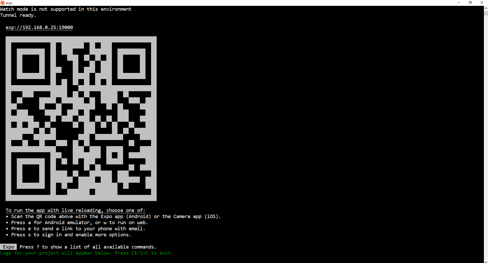

# React Native: Tinder UI Clone - How to swipe in React Native

*February 2020*

> 🔨 Swipe components with images swiping like in Tinder. Tutorial: '[Tinder UI Clone](https://blog.expo.io/tutorial-tinder-ui-clone-18f72048d1a4)'.

## About

In this application, we can swipe between images.

The cards are animated and follow the finger direction. If the card enter in some threshold and the finger is released, it's replaced by another card. Otherwise the card comes back to its initial position.

## Techs covered

- PanResponder, ScrollView, Animated components

## How to use

- Clone
- `expo start`

With Expo, you can use real Smartphone (you will also need the app on your Smartphone), webview or smartphone emulator to see the application.

## Ressources

- [Expo CLI](https://docs.expo.io/versions/latest/workflow/expo-cli/)
- [Expo Android](https://play.google.com/store/apps/details?id=host.exp.exponent)
- [Expo IOS](https://apps.apple.com/fr/app/expo-client/id982107779)
- [Unsure Programmer](https://www.youtube.com/channel/UCiNWv52iO_OAdZ12kslG4Cg)
